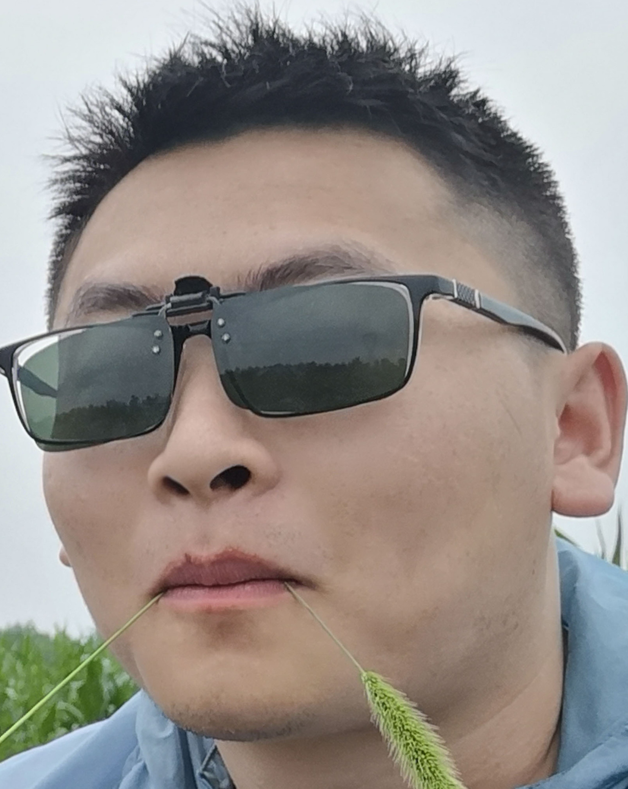

Hello and welcome! I am Yangyang Li, a Ph.D. candidate in the DGP Program at Northwestern University Feinberg School of Medicine.
I specialize in developing algorithms and deep learning methods to tackle
challenging biological problems.

I am a fourth-year Ph.D. candidate at the intersection of deep learning, algorithmic efficiency, and computational biology.
My research harnesses cutting-edge machine learning techniques and high-performance computing to unravel complex biological
enigmas.
With a proven track record in developing innovative research software and data-driven solutions, I excel at translating
intricate scientific challenges into actionable insights.
Driven by a passion for pushing the boundaries of bioinformatics, I am poised to make significant contributions in a dynamic, research-intensive environment where I can continue to evolve as a
scientist and innovator.

Beyond my academic pursuits, I have a keen interest in keeping a finger on the pulse of the latest tech industry advancements.
I'm always on the lookout to learn novel programming languages and refine my techniques.
When the rigors of academia don't have me occupied, I'm either immersing myself in fresh side projects or embracing the serenity of the outdoors.

I conceived this website as a platform to relay my experiences, insights, and invaluable resources to fellow enthusiasts in the programming and deep learning realms.
It's my earnest wish that you derive inspiration, knowledge, or even a hint of curiosity from my shared content!

A cup of coffee will support me to insist sharing :smile:

