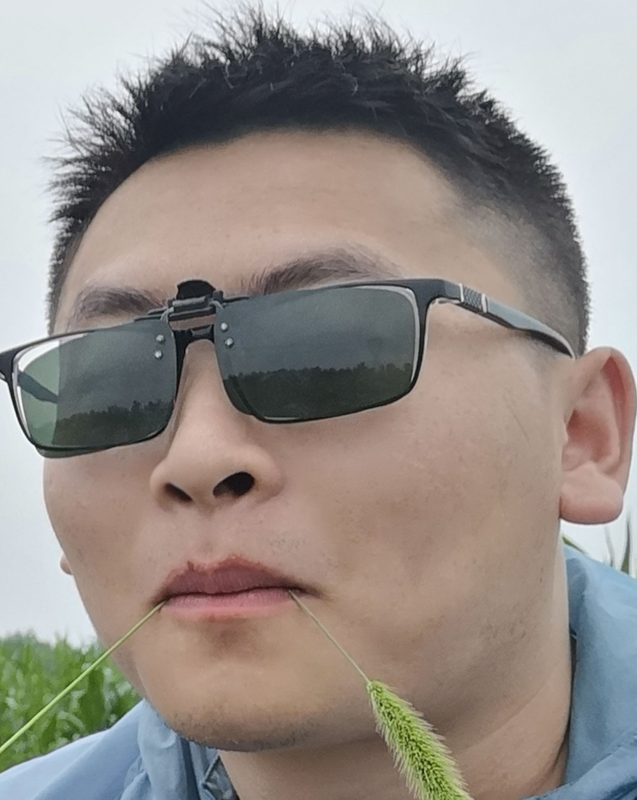


I build deep-learning models and fast algorithms that turn long-read sequencing data into biology.


## About Me

Hello! I'm **Yangyang Li**, a fifth-year Ph.D. candidate in the DGP Program at Northwestern University Feinberg School of Medicine. As I approach graduation, I'm actively exploring opportunities where I can apply my expertise in AI and computational biology to solve real-world challenges.


 Rust 
 Python 
 C++ 
 Deep Learning 
 Genomic Language Models 
 Long-read Sequencing 
 CUDA / HPC 


## Research Focus



Novel neural network architectures for biological sequence data, from tokenization to deployment.


Scalable algorithms for large-scale genomic datasets, written in Rust and C++ and tuned for real clusters.


Research software that translates complex biological data into actionable insights.



I specialize in developing efficient algorithms and deep learning methods for challenging problems in computational biology, particularly in genomic interval analysis and AI-driven biomedical research.

## Selected Work








&nbsp;


## This Blog

This website serves as a platform where I share:

- Technical tutorials and guides on AI, programming, and bioinformatics
- Research insights and computational methods
- Development resources and best practices
- Learning experiences in deep learning and software engineering

Whether you're a researcher, developer, or student, I hope you find valuable resources here.

## Get in Touch


&nbsp;GitHub

&nbsp;

&nbsp;Google Scholar

&nbsp;

&nbsp;LinkedIn


## Support My Work

If you find my content helpful, consider supporting my work. Your contribution helps me continue creating and sharing quality content.

