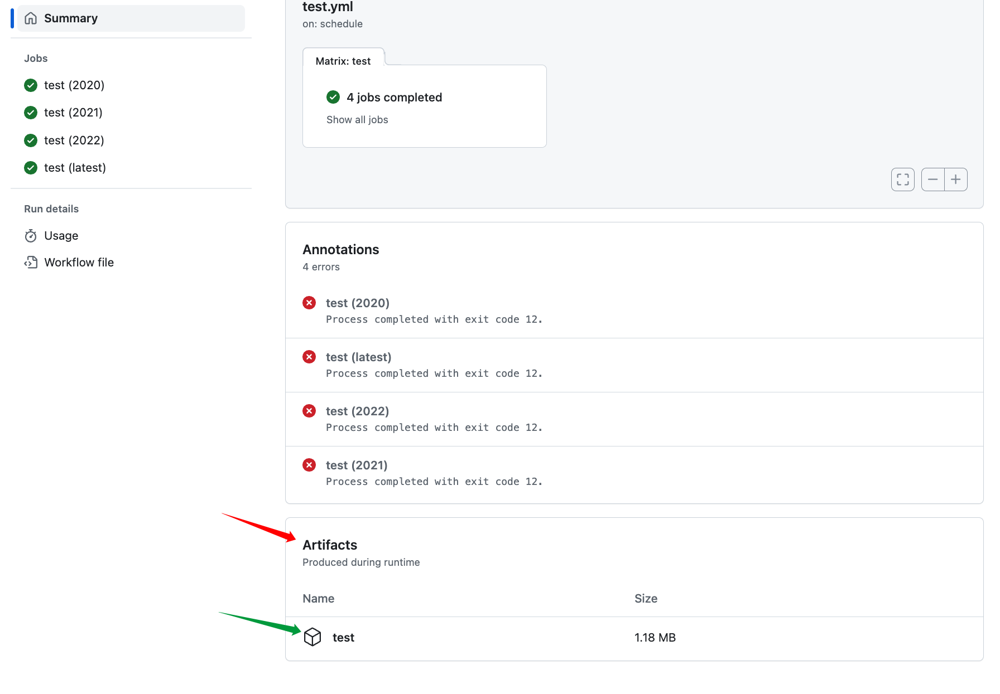

## Latex

LaTeX functions as an intricate tool for the meticulous creation of scientific documents, enriched by a comprehensive ecosystem and an extensive assortment of templates.
I habitually utilize LaTeX for a plethora of activities, including the annotation of notes, the authoring of scholarly articles, and the formulation of thesis.
GitHub serves as an indispensable medium for version management and collaborative endeavors.
As such, automating the assembly procedure of LaTeX documents through GitHub would confer significant benefits.

## GitHub Action

In an era where automation reigns supreme, GitHub Actions distinguish themselves as a paramount utility for streamlining software operations.
This blog explores the nuances of configuring a GitHub Action to autonomously compile LaTeX manuscripts, archive the resulting files, and initiate subsequent code commits.
Embark with us on this enlightening journey.
Utilizing the `actions/checkout` action, we commence by crafting a rudimentary YAML file designed to trigger the compilation sequence for the LaTeX manuscript.



```yml
name: Build LaTeX document
on: [push]
jobs:
  build_latex:
    runs-on: ubuntu-latest
    steps:
      - name: Set up Git repository
        uses: actions/checkout@v3
```

To elevate the compilation workflow, the `xu-cheng/latex-action` action can be enlisted.
This grants the flexibility to delineate auxiliary parameters, such as the root file and the destination directory for output.



```yml
name: Build LaTeX document
on: [push]
jobs:
  build_latex:
    runs-on: ubuntu-latest
    steps:
      - name: Set up Git repository
        uses: actions/checkout@v3

      - name: Compile main.tex
        uses: xu-cheng/latex-action@v2
        with:
          root_file: "main.tex"
          latexmk_use_lualatex: true
          latexmk_shell_escape: true
          args: "-output-directory=."
```

In this configuration, we utilize `lualatex` to compile `main.tex`, incorporating the `shell_escape` feature, with the output directed to the current directory.
It is often advantageous to arrange the resultant files systematically.
To illustrate this, the example demonstrates how to modify the output directory for the LaTeX documents, designating `./gallery` as the target location.

```yml
name: Build LaTeX document
on: [push]
jobs:
  build_latex:
    runs-on: ubuntu-latest
    steps:
      - name: Set up Git repository
        uses: actions/checkout@v3

      - name: Compile main.tex
        uses: xu-cheng/latex-action@v2
        with:
          root_file: "main.tex"
          latexmk_use_lualatex: true
          latexmk_shell_escape: true
          args: "-output-directory=./gallery"
```

Simultaneously, GitHub Actions simplifies the process of archiving the generated PDF for future reference or in-depth scrutiny.

```yml
name: Build LaTeX document
on: [push]
jobs:
  build_latex:
    runs-on: ubuntu-latest
    steps:
      - name: Set up Git repository
        uses: actions/checkout@v3

      - name: Compile main.tex
        uses: xu-cheng/latex-action@v2
        with:
          root_file: "main.tex"
          latexmk_use_lualatex: true
          latexmk_shell_escape: true
          args: "-output-directory=."

      - name: Upload PDF file
        uses: actions/upload-artifact@v3
        with:
          name: PDF
          path: main.pdf
```

In this step, we upload the compiled `main.pdf` file, making it accessible for download from the artifact section of the corresponding GitHub Action, as illustrated in the subsequent figure.

[](https://github.com/xu-cheng/latex-action/actions/runs/6061408257)

## Compilation of Multiple Documents

Additionally, the setup affords us the flexibility to compile an array of `.tex` files situated in nested directories.
In this instance, we compile both `main.tex` and all `.tex` files residing within the `source/` directory.

```yml
root_file: "source/*.tex"
glob_root_file: true
```

The resultant artifacts are neatly stored in the `./gallery` directory.

```yml
name: Build LaTeX document
on: [push]
jobs:
  build_latex:
    runs-on: ubuntu-latest
    steps:
      - name: Set up Git repository
        uses: actions/checkout@v3

      - name: Compile main.tex
        uses: xu-cheng/latex-action@v2
        with:
          root_file: "main.tex"
          latexmk_use_lualatex: true
          latexmk_shell_escape: true
          args: "-output-directory=./gallery"

      - name: Compile source/*.tex
        uses: xu-cheng/latex-action@v2
        with:
          root_file: "source/*.tex"
          glob_root_file: true
          latexmk_use_lualatex: true
          latexmk_shell_escape: true
          args: "-output-directory=./gallery"
```

## Committing Recent Modifications

Significantly, the GitHub actions also enable us to automate the task of committing alterations back to the repository.



```yml
name: Build LaTeX document
on: [push]
jobs:
  build_latex:
    runs-on: ubuntu-latest
    steps:
      - name: Set up Git repository
        uses: actions/checkout@v3

      - name: Compile main.tex
        uses: xu-cheng/latex-action@v2
        with:
          root_file: "main.tex"
          latexmk_use_lualatex: true
          latexmk_shell_escape: true
          args: "-output-directory=./gallery"

      - name: Compile source/*.tex
        uses: xu-cheng/latex-action@v2
        with:
          root_file: "source/*.tex"
          glob_root_file: true
          latexmk_use_lualatex: true
          latexmk_shell_escape: true
          args: "-output-directory=./gallery"

      - name: Commit files
        run: |
          git config --local user.email "41898282+github-actions[bot]@users.noreply.github.com"
          git config --local user.name "github-actions[bot]"
          git status
          git add .
          git commit -m "update example and readme" -a

      - name: Push changes
        uses: ad-m/github-push-action@master
        with:
          github_token: ${{ secrets.GITHUB_TOKEN }}
          branch: main
```

## Utilizing Caching Mechanisms

Streamlining the workflow is effortlessly achieved through the deployment of GitHub Actions' caching capabilities, thereby reducing execution time and enhancing operational efficiency.

```yml
name: Build LaTeX document
on: [push]
jobs:
  build_latex:
    runs-on: ubuntu-latest
    steps:
      - name: Set up Git repository
        uses: actions/checkout@v3

      - name: Cache LaTeX dependencies
        uses: actions/cache@v3
        with:
          path: /usr/local/share/texmf
          key: ${{ runner.os }}-texmf-${{ hashFiles('**/*.tex') }}

      - name: Cache auxiliary files
        uses: actions/cache@v3
        with:
          path: ./gallery
          key: ${{ runner.os }}-auxfiles-${{ hashFiles('**/*.tex') }}
          restore-keys: |
            ${{ runner.os }}-auxfiles-

      - name: Compile main.tex
        uses: xu-cheng/latex-action@v2
        with:
          root_file: "main.tex"
          latexmk_use_lualatex: true
          latexmk_shell_escape: true
          args: "-output-directory=./gallery"

      - name: Compile source/*.tex
        uses: xu-cheng/latex-action@v2
        with:
          root_file: "source/*.tex"
          glob_root_file: true
          latexmk_use_lualatex: true
          latexmk_shell_escape: true
          args: "-output-directory=./gallery"

      - name: Commit files
        run: |
          git config --local user.email "41898282+github-actions[bot]@users.noreply.github.com"
          git config --local user.name "github-actions[bot]"
          git status
          git add .
          git commit -m "update example and readme" -a

      - name: Push changes
        uses: ad-m/github-push-action@master
        with:
          github_token: ${{ secrets.GITHUB_TOKEN }}
          branch: main
```

## Examples

Utilizing GitHub Actions, we can construct a nuanced, yet efficient, workflow for the compilation of LaTeX manuscripts.
The aforementioned examples merely act as foundational elements; truly, the possibilities are boundless.




