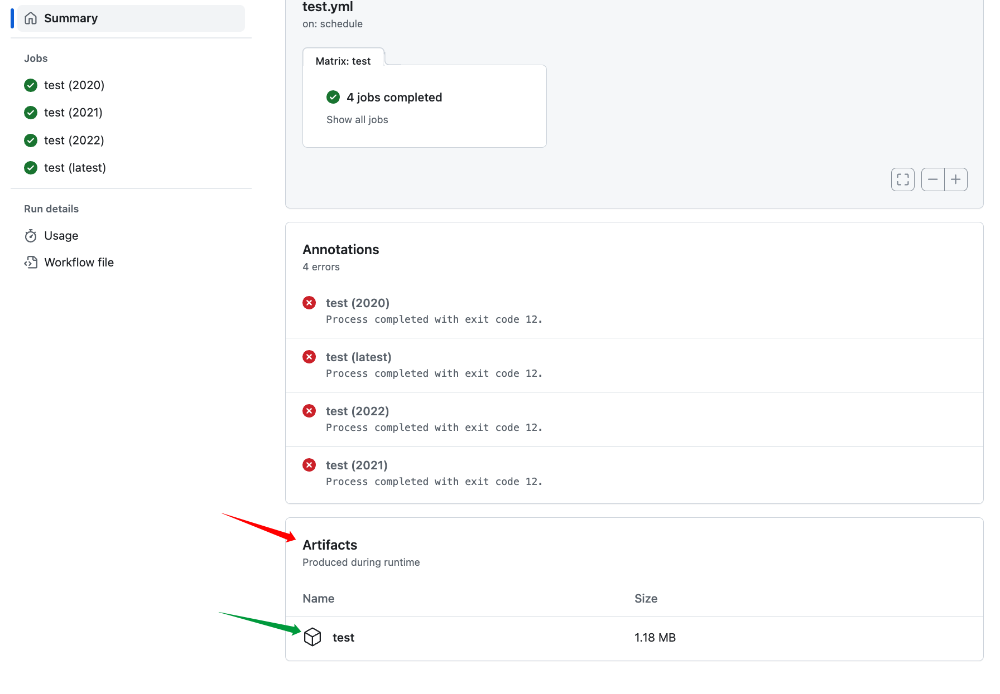

## Why automate a LaTeX build

LaTeX is my tool of choice for scientific writing: notes, papers, and my thesis all live in `.tex` files, with a large ecosystem of packages and templates behind them.
GitHub is where I keep those files under version control and collaborate on them.
Building the documents automatically on every push closes the loop: the compiled PDF is always up to date, and a broken build is caught immediately.

This post walks through a GitHub Actions workflow that compiles LaTeX documents, stores the resulting PDFs, commits them back to the repository, and caches dependencies to keep the build fast.

## Build a basic workflow

The first version of the workflow only checks out the repository with `actions/checkout`, then compiles it with `xu-cheng/latex-action`, which wraps `latexmk` in a container with a full TeX Live installation.








Create `.github/workflows/build.yml` with a single job that checks out the code on every push.

```yml
name: Build LaTeX document
on: [push]
jobs:
  build_latex:
    runs-on: ubuntu-latest
    steps:
      - name: Set up Git repository
        uses: actions/checkout@v3
```




Add a `xu-cheng/latex-action` step. It accepts the root file, the engine, and extra `latexmk` arguments. Here `main.tex` is compiled with `lualatex`, shell escape is enabled, and the output goes to the current directory.

```yml
name: Build LaTeX document
on: [push]
jobs:
  build_latex:
    runs-on: ubuntu-latest
    steps:
      - name: Set up Git repository
        uses: actions/checkout@v3

      - name: Compile main.tex
        uses: xu-cheng/latex-action@v2
        with:
          root_file: "main.tex"
          latexmk_use_lualatex: true
          latexmk_shell_escape: true
          args: "-output-directory=."
```




Keeping build products in a dedicated folder is tidier. Point `-output-directory` at `./gallery` to collect the PDFs there.

```yml
name: Build LaTeX document
on: [push]
jobs:
  build_latex:
    runs-on: ubuntu-latest
    steps:
      - name: Set up Git repository
        uses: actions/checkout@v3

      - name: Compile main.tex
        uses: xu-cheng/latex-action@v2
        with:
          root_file: "main.tex"
          latexmk_use_lualatex: true
          latexmk_shell_escape: true
          args: "-output-directory=./gallery"
```




To keep a copy of every build, upload the PDF with `actions/upload-artifact`. The file then appears in the artifact section of the workflow run.

```yml
name: Build LaTeX document
on: [push]
jobs:
  build_latex:
    runs-on: ubuntu-latest
    steps:
      - name: Set up Git repository
        uses: actions/checkout@v3

      - name: Compile main.tex
        uses: xu-cheng/latex-action@v2
        with:
          root_file: "main.tex"
          latexmk_use_lualatex: true
          latexmk_shell_escape: true
          args: "-output-directory=."

      - name: Upload PDF file
        uses: actions/upload-artifact@v3
        with:
          name: PDF
          path: main.pdf
```





The uploaded `main.pdf` can be downloaded from the run summary, as shown below.

[](https://github.com/xu-cheng/latex-action/actions/runs/6061408257)

## Compile multiple documents

The same action can compile several `.tex` files, including files in nested directories.
Set `root_file` to a glob and enable `glob_root_file`:

```yml
root_file: "source/*.tex"
glob_root_file: true
```

The workflow below compiles both `main.tex` and every `.tex` file under `source/`, writing all output to `./gallery`.

```yml
name: Build LaTeX document
on: [push]
jobs:
  build_latex:
    runs-on: ubuntu-latest
    steps:
      - name: Set up Git repository
        uses: actions/checkout@v3

      - name: Compile main.tex
        uses: xu-cheng/latex-action@v2
        with:
          root_file: "main.tex"
          latexmk_use_lualatex: true
          latexmk_shell_escape: true
          args: "-output-directory=./gallery"

      - name: Compile source/*.tex
        uses: xu-cheng/latex-action@v2
        with:
          root_file: "source/*.tex"
          glob_root_file: true
          latexmk_use_lualatex: true
          latexmk_shell_escape: true
          args: "-output-directory=./gallery"
```

## Commit the build output

The workflow can also commit the generated files back to the repository, so the PDFs in `gallery/` always match the sources.
The commit is made with the built-in `github-actions[bot]` identity and pushed with `ad-m/github-push-action`.



```yml
name: Build LaTeX document
on: [push]
jobs:
  build_latex:
    runs-on: ubuntu-latest
    steps:
      - name: Set up Git repository
        uses: actions/checkout@v3

      - name: Compile main.tex
        uses: xu-cheng/latex-action@v2
        with:
          root_file: "main.tex"
          latexmk_use_lualatex: true
          latexmk_shell_escape: true
          args: "-output-directory=./gallery"

      - name: Compile source/*.tex
        uses: xu-cheng/latex-action@v2
        with:
          root_file: "source/*.tex"
          glob_root_file: true
          latexmk_use_lualatex: true
          latexmk_shell_escape: true
          args: "-output-directory=./gallery"

      - name: Commit files
        run: |
          git config --local user.email "41898282+github-actions[bot]@users.noreply.github.com"
          git config --local user.name "github-actions[bot]"
          git status
          git add .
          git commit -m "update example and readme" -a

      - name: Push changes
        uses: ad-m/github-push-action@master
        with:
          github_token: ${{ secrets.GITHUB_TOKEN }}
          branch: main
```

## Cache dependencies

Finally, `actions/cache` shortens the run time by restoring the TeX tree and the auxiliary files from previous builds.
The cache keys are derived from the hash of all `.tex` files, so the cache is refreshed whenever the sources change.

```yml
name: Build LaTeX document
on: [push]
jobs:
  build_latex:
    runs-on: ubuntu-latest
    steps:
      - name: Set up Git repository
        uses: actions/checkout@v3

      - name: Cache LaTeX dependencies
        uses: actions/cache@v3
        with:
          path: /usr/local/share/texmf
          key: ${{ runner.os }}-texmf-${{ hashFiles('**/*.tex') }}

      - name: Cache auxiliary files
        uses: actions/cache@v3
        with:
          path: ./gallery
          key: ${{ runner.os }}-auxfiles-${{ hashFiles('**/*.tex') }}
          restore-keys: |
            ${{ runner.os }}-auxfiles-

      - name: Compile main.tex
        uses: xu-cheng/latex-action@v2
        with:
          root_file: "main.tex"
          latexmk_use_lualatex: true
          latexmk_shell_escape: true
          args: "-output-directory=./gallery"

      - name: Compile source/*.tex
        uses: xu-cheng/latex-action@v2
        with:
          root_file: "source/*.tex"
          glob_root_file: true
          latexmk_use_lualatex: true
          latexmk_shell_escape: true
          args: "-output-directory=./gallery"

      - name: Commit files
        run: |
          git config --local user.email "41898282+github-actions[bot]@users.noreply.github.com"
          git config --local user.name "github-actions[bot]"
          git status
          git add .
          git commit -m "update example and readme" -a

      - name: Push changes
        uses: ad-m/github-push-action@master
        with:
          github_token: ${{ secrets.GITHUB_TOKEN }}
          branch: main
```

## Examples

These workflows are a starting point rather than a finished product; adapt them to your own repository layout.
Two of my repositories use this setup:






