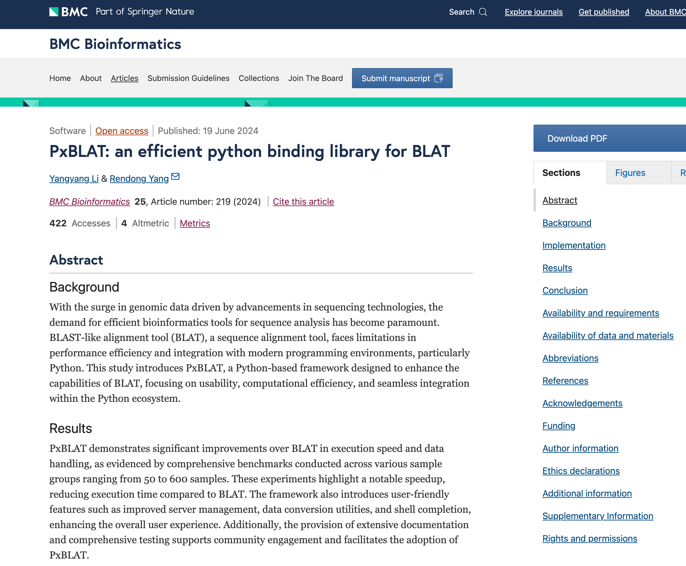
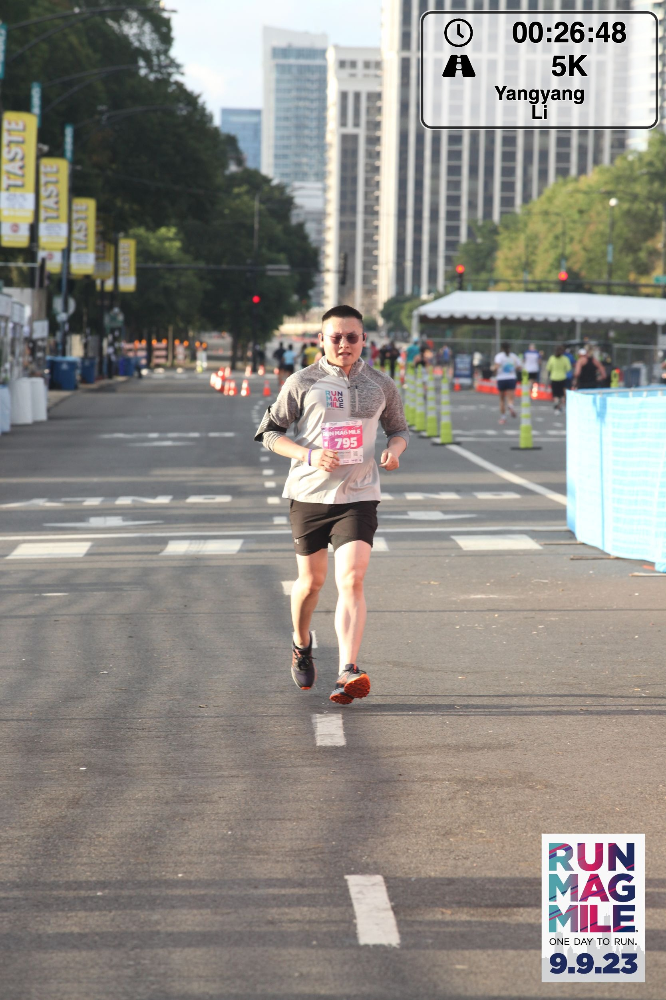
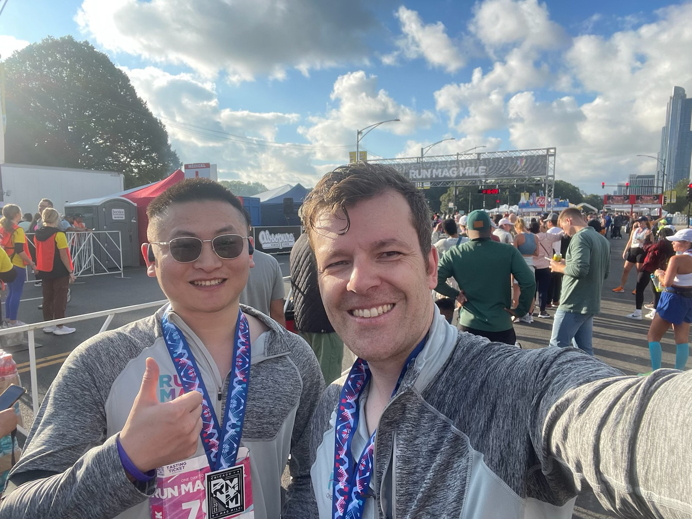
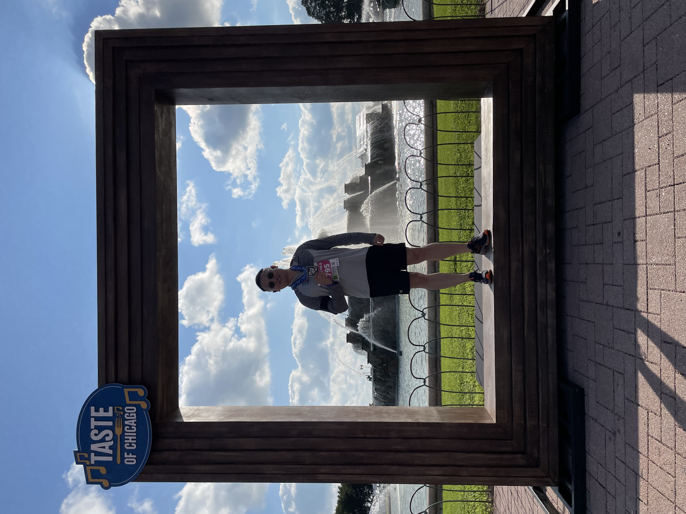
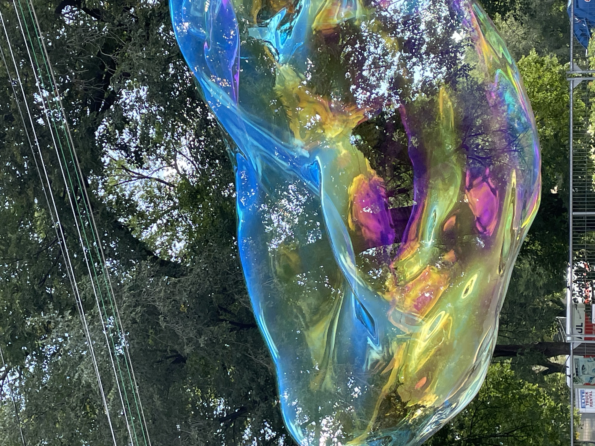
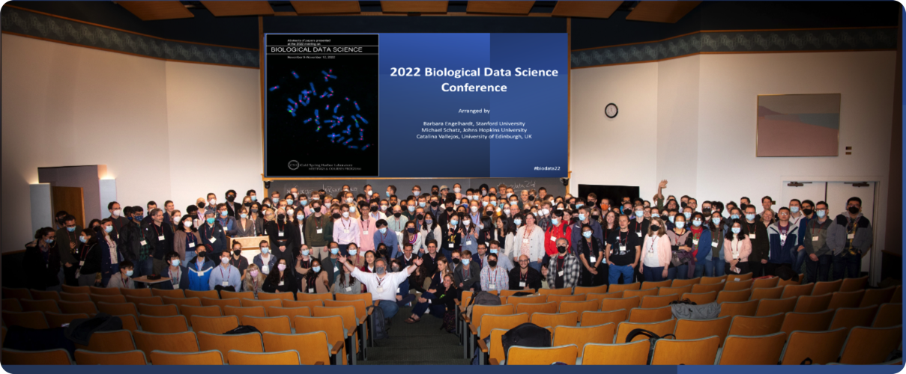
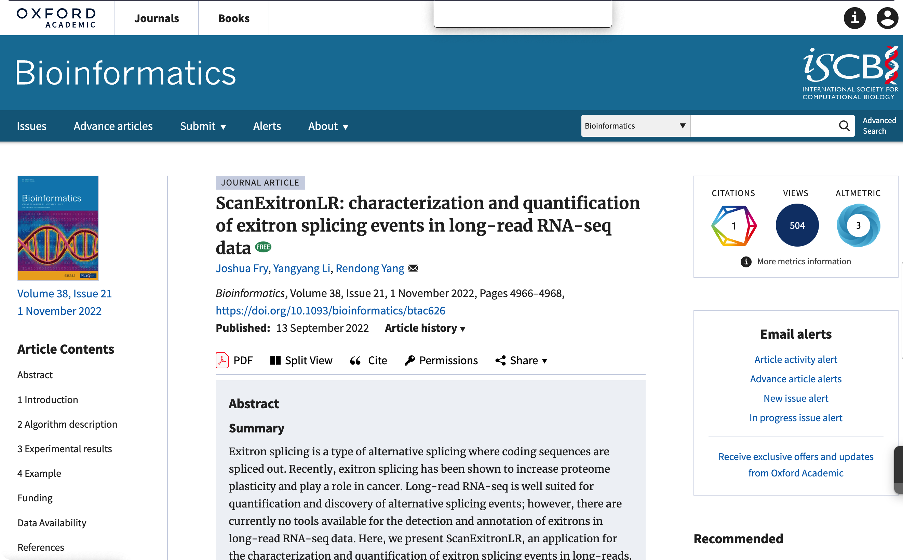
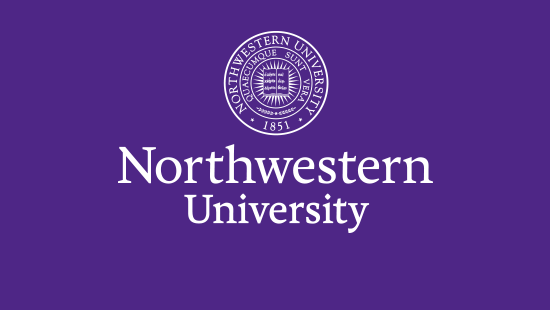


The pulse of the present, echoing in the halls of Bytes of Life.


---

<!-- prettier-ignore-start -->

<!-- timelineItem icon="graduation-cap" header="Become Ph.D. Candidate" badge="2023-06-15" subheader="subheader" -->
<!--  -->

<!-- <ul> -->
<!--   <li>Coffee</li> -->
<!--   <li>Tea</li> -->
<!--   <li>Milk</li> -->
<!-- </ul> -->
<!--  -->

<!--  -->
<!-- With other shortcodes -->
<!--  -->
<!--  -->
<!--  -->
<!--  -->
<!--  -->
<!--  -->
<!--  -->
<!--  -->
<!--  -->
<!--  -->




























<a href="https://meetings.cshl.edu/archivesmeetings.aspx?meet=DATA&year=22" target="_blank">Continuing Reading</a>




<a href="https://pubmed.ncbi.nlm.nih.gov/36099042" target="_blank">Continuing Reading</a>




<a href="https://www.feinberg.northwestern.edu" target="_blank">Northwestern University</a>



<a href="https://twin-cities.umn.edu/" target="_blank">University of Minnesota</a>



<a href="https://en.cau.edu.cn" target="_blank">China Agricultural University</a>




<!-- prettier-ignore-end -->
