
A running timeline of publications, workshops, awards, and other milestones.


---

<!-- prettier-ignore-start -->




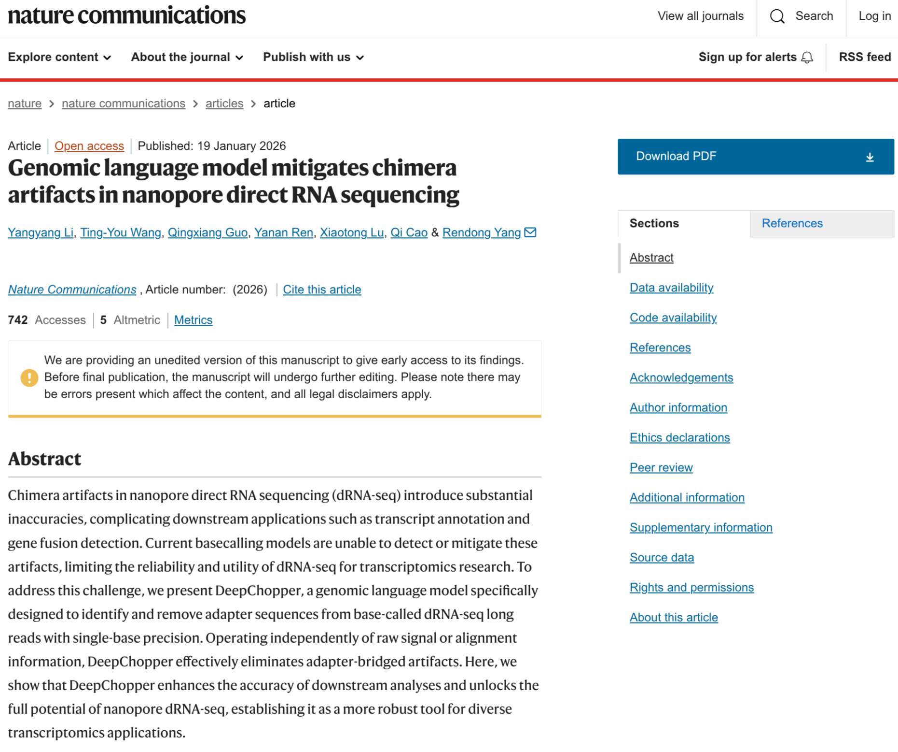




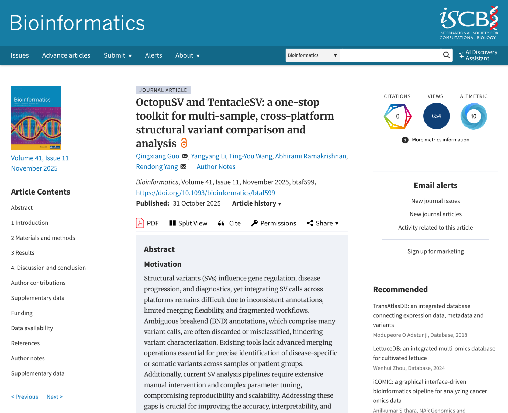




<a href="https://yangyangli.top/workshop_next_step_in_python_05052025/#/title-slide">  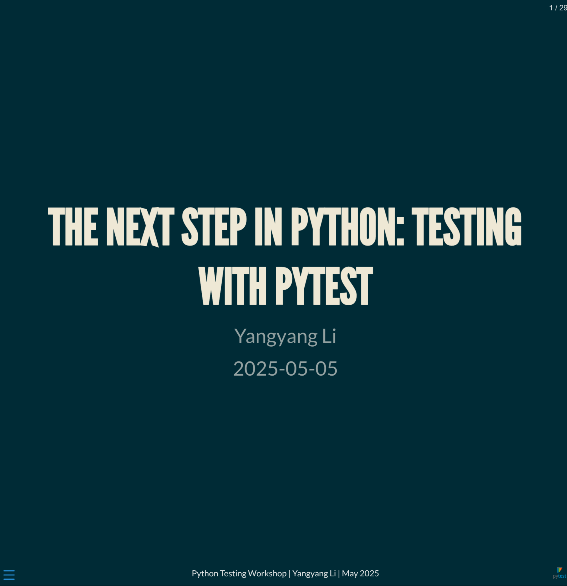 </a>




<a href="https://yangyangli.top/Visualizing-Data-with-Seaborn/">  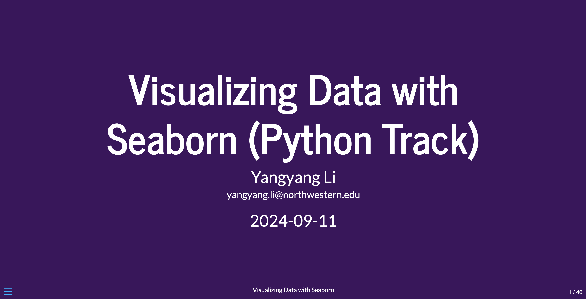 </a>




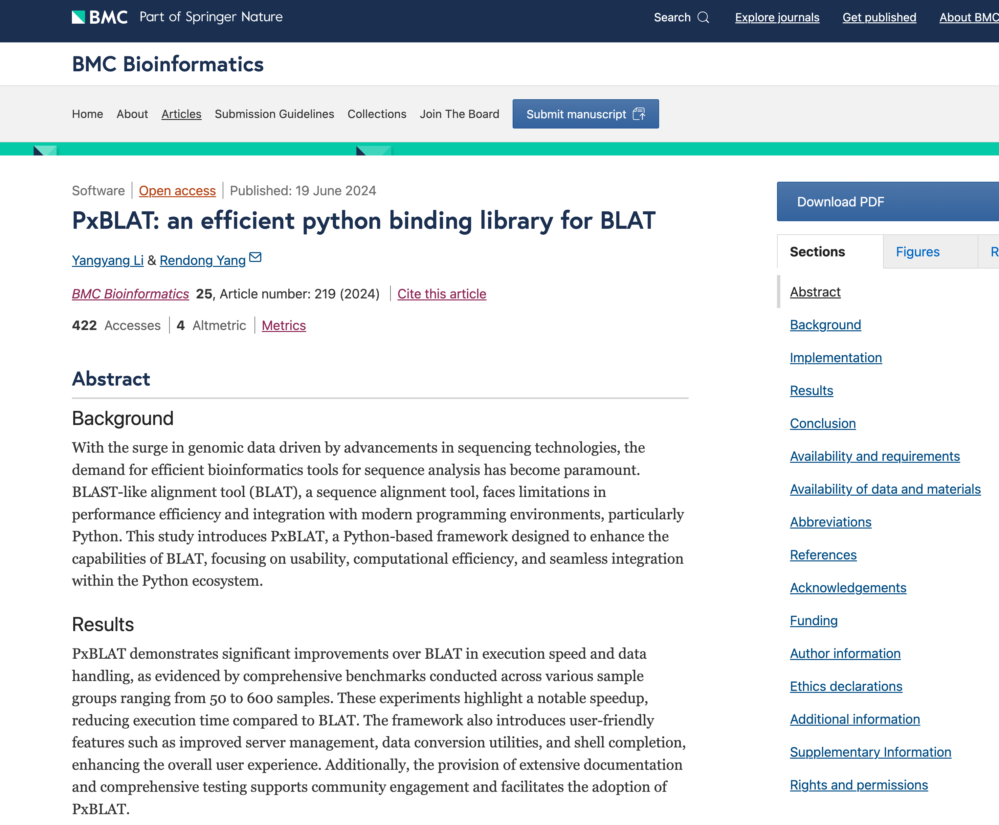



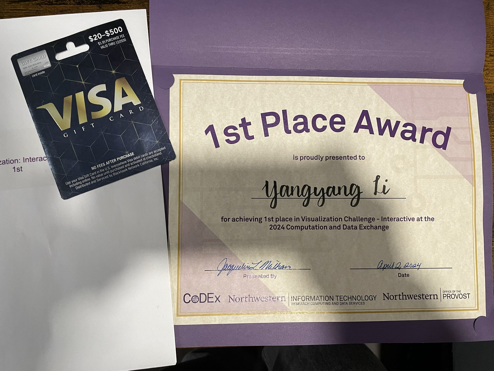




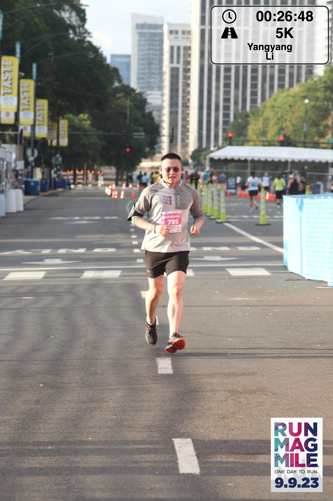
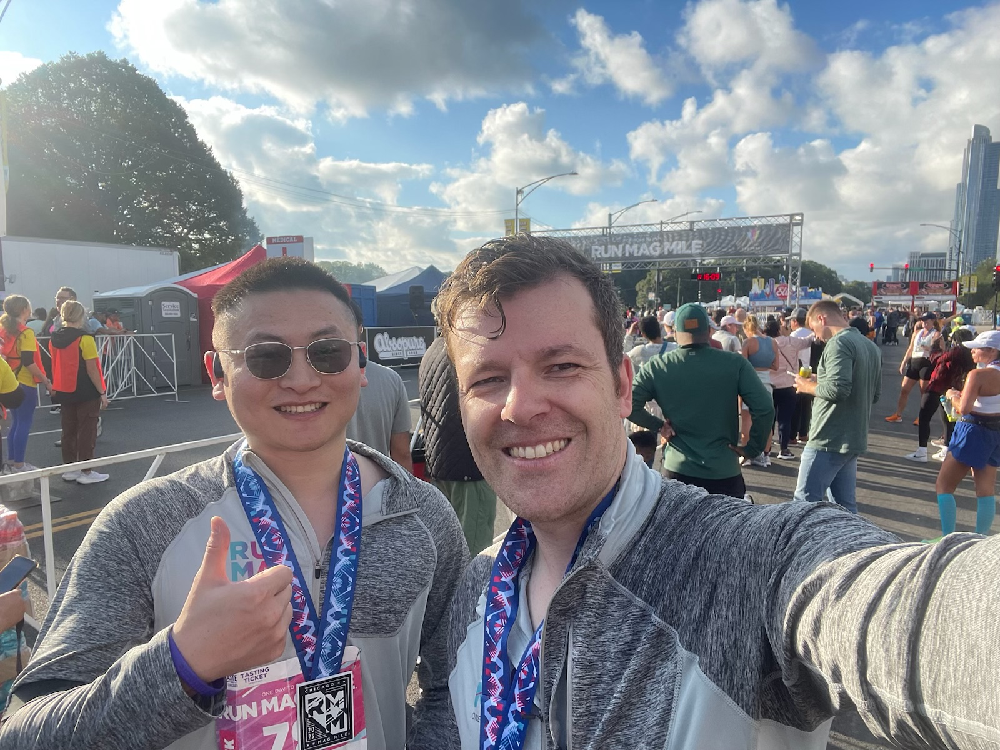
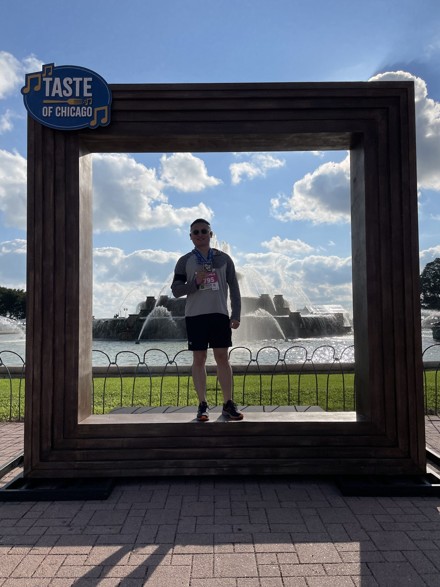
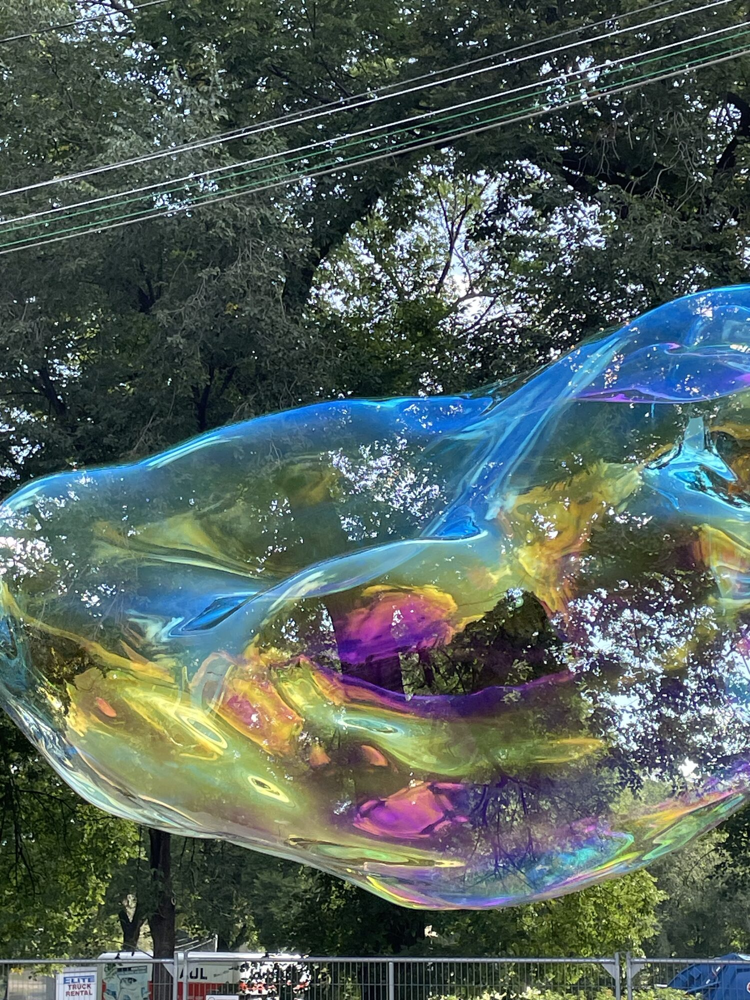













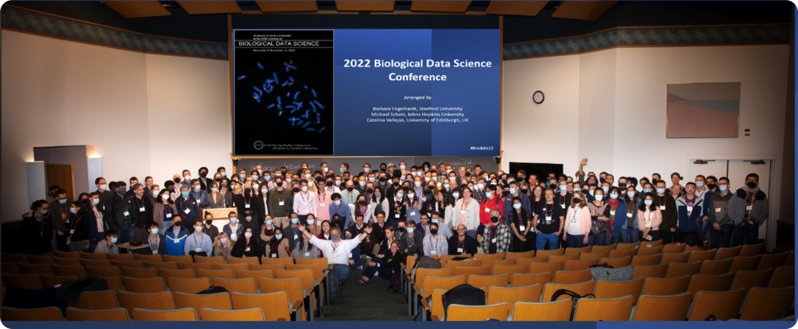
<a href="https://meetings.cshl.edu/archivesmeetings.aspx?meet=DATA&year=22" target="_blank">Continue reading</a>



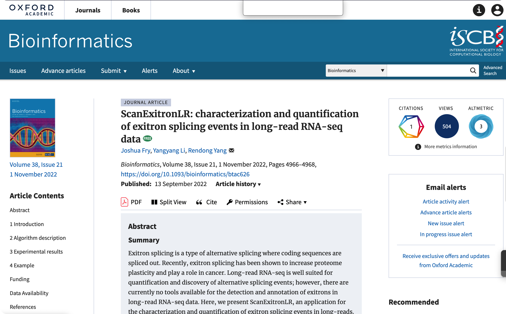
<a href="https://pubmed.ncbi.nlm.nih.gov/36099042" target="_blank">Continue reading</a>



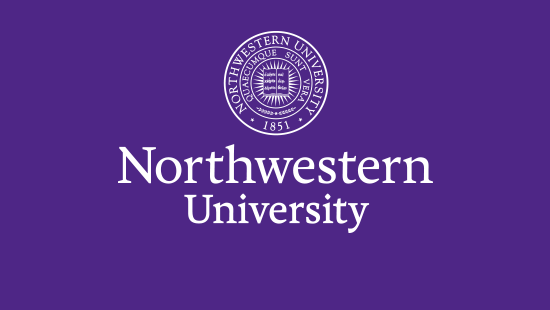
<a href="https://www.feinberg.northwestern.edu" target="_blank">Northwestern University</a>



<a href="https://twin-cities.umn.edu/" target="_blank">University of Minnesota</a>



<a href="https://en.cau.edu.cn" target="_blank">China Agricultural University</a>




<!-- prettier-ignore-end -->
