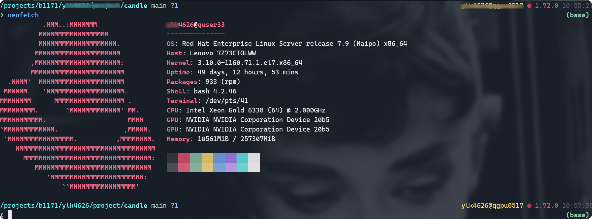
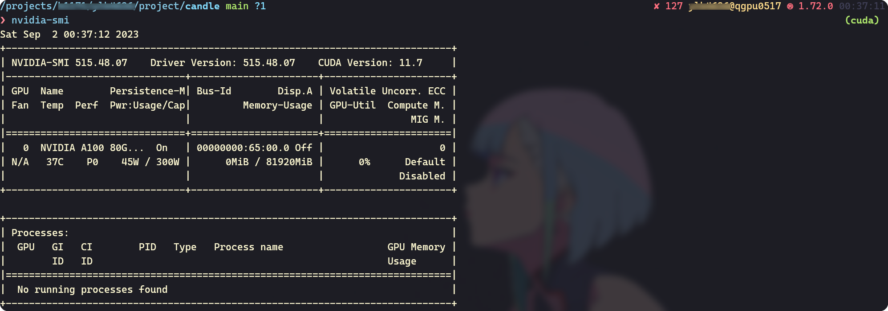
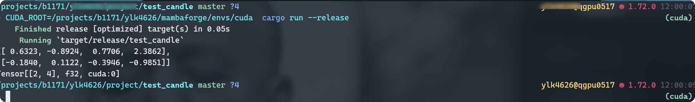
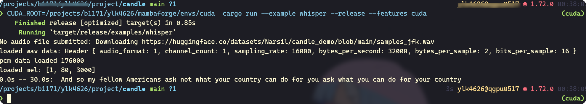
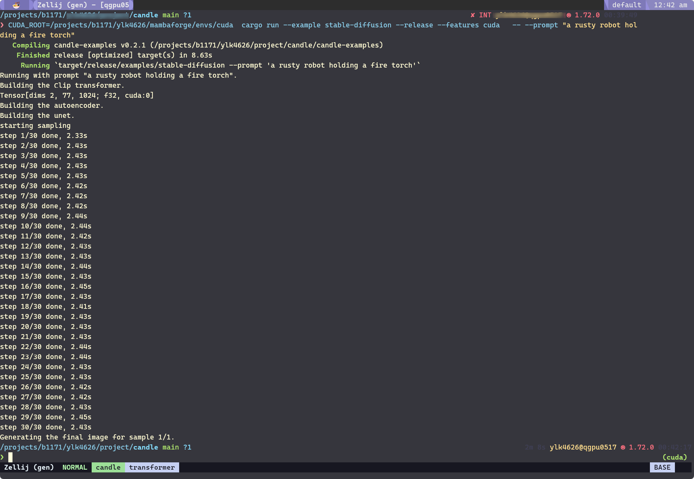

## 1. Deep Learning Inference

Currently, both Rust and C++ are emerging as noteworthy contenders in the realm
of deep learning, primarily due to their efficiency despite Python's prevailing
dominance in model training.
While Python continues to commandeer the training phase, it lags in performance
during inference.
Large Language Models (LLMs), such as ChatGPT, have burgeoned since their
inception, instigating a competitive frenzy among corporations and research
organizations alike.
This has led to an explosion of various LLMs, although not all exhibit equal
utility or value.

Furthermore, expansive image generation models, such as stable diffusion
and midjourney, are capturing considering attention.
Both LLMs and these advanced image generators possess a common characteristic:
they are engineered with billions of parameters, occupying gigabytes of memory.

Privacy remains a paramount concern for users of LLMs.
The prevailing sentiment is a reluctance to have our data harvested by these computational behemoths without compensation.
Recent open-source entrants like llama aim to challenge established players like ChatGPT while prioritizing user privacy.
The optimal course of action in terms of privacy is to operate these models on personal devices.
However, the hardware constraints, particularly the lack of powerful CPUs or GPUs, pose a challenge.
Therefore, there is an urgent impetus within the community to optimize model execution speed.
The [llama.cpp] inference framework, written in C/C++ and utilizing advanced techniques like SIMD, quantization, mixed precision, and acceleration for different backend (GPU, MKL, etc.), addresses this need.
Contributions from the open-source community have enabled popular models to be
inferenced via [llama.cpp], thereby democratizing access to LLMs across various
devices.

While C++ and [llama.cpp] off sbstantial benefits, Rust carves out its own
niche, particularly excelling in WebAssembly and the development of web or GUI
application[^1].
Server nascent yet rapidly evolving deep learning framework, such as [dfdx], [burn], and [candle], are implemented purely in Rust and offer cross-platform compatibility with various accerlated backends.

In summary, upon completion of the model training phase, deployment can be effectively handled by either llama.cpp or Rust-based solutions.
This facilitates the accessibility of large-scale deep learning models across an array of devices and platforms.
As for my personal setup, I utilize a MacBook Pro with an M1 chip and rely on a remote High-Performance Computing (HPC) cluster for CUDA capabilities.
Further details about the HPC setup are delineated in the subsequent figure.



## 2. Check your CUDA driver version

Unfortunately, I continue to encounter issues while attempting to configure the CUDA environment on a High-Performance Computing (HPC) cluster.
This blog post will chronicle my journey to surmount these obstacles without administrative right.

In order to establish a functional CUDA environment for both Rust and C++, it's imperative to confirm that all requisite CUDA libraries and headers are correctly installed.
Subsequently, the build system must be configured to link against these specific libraries.
Moreover, it may be necessary to delineate the appropriate compiler flags and paths to facilitate seamless CUDA integration.

For illustrative purposes, consider my personal device configuration:

```bash
nvidia-smi
```



In the remote High-Performance Computing (HPC) cluster, the CUDA Driver is version 11.7.
Typically, we lack administrative access, precluding us from updating the driver to a newer version.
Consequently, it becomes necessary to install a matching CUDA 11.7 suite to ensure compatibility.

## 3. Use CONDA to install CUDA and gcc/g++

I advocate for the use of [mamba] as an alternative to [conda], given its superior efficiency in resolving and installing dependencies.
For the purposes of the ensuing example, I shall designate `/home/mambaforge` as the installation directory for [mamba].


Do not forget to change to your own installation location when you plan to give
it a try.


### Create new environment

Let's establish a fresh environment to circumvent any dependency conflicts.
Python 3.10 currently serves as the stable release.

```bash
mamba create -n cuda python=3.10
mamba activate cuda
```

### Install CUDA

We install the CUDA package from the [nvidia] channel, opting for a specific version by employing designated labels.
In this instance, we are installing CUDA 11.7.

```bash
mamba install cuda -c nvidia/label/cuda-11.7.0
```

### Install compiler

Additionally, it's imperative to install a compatible compiler;
failing to do so may result in the utilization of system-default compilers, such as `/usr/bin/gcc`, during the code compilation process.

```bash
mamba install gcc=11.0 gxx=11.0 cmake
```

It's essential to define the environment variable `CUDA_ROOT` in order to effectively utilize CUDA.

```bash
CUDA_ROOT=/home/mambaforg/envs/cuda RUSTFLAGS="-L/home/mambaforge/envs/cuda/lib/stubs" cargo run
CUDA_ROOT=/home/mambaforg/envs/cuda g++ -o test test.cpp
```

Let's configure an environment-specific variable so as to obviate the need for setting `CUDA_ROOT` repeatedly.

```bash
mamba env config vars set CUDA_ROOT=/home/mambaforg/envs/cuda
mamba env config vars set RUSTFLAGS="-L/home/mambaforge/envs/cuda/lib/stubs"
```

Reactivating the environment to make the environment "alive".

```bash
mamba activate cuda
```

## 4. Quick start for candle

[candle] is a deep learning framework crafted in Rust, a programming language that excels in WebAssembly development.
A suite of robust and maturing full-stack WebAssembly libraries, including [leptos] and [dixous], further underscores Rust's capabilities.
Therefore, if the objective is to create a web application underpinned by deep learning technologies, Rust emerges as the significant choice.
Let's proceed to experiment with [candle] in conjunction with CUDA.

```bash
cargo new test_candle
cd test_candle
```

Incorporate `candle` into the project's dependencies, specifying CUDA as a featured attribute.

```bash
cargo add candle_core --features cuda
```

Let's modify the `src/main.rs` file and initially conduct a test run on the CPU.

```rust
use candle_core::{Device, Tensor};

fn main() -> Result<(), Box<dyn std::error::Error>> {
    let device = Device::Cpu;

    let a = Tensor::randn(0f32, 1., (2, 3), &device)?;
    let b = Tensor::randn(0f32, 1., (3, 4), &device)?;

    let c = a.matmul(&b)?;
    println!("{c}");
    Ok(())
}
```

Execute the code:

```bash
cargo run
```

In this instance, we are utilizing the GPU.

```rust
use candle_core::{Device, Tensor};

fn main() -> Result<(), Box<dyn std::error::Error>> {
    let device = Device::new_cuda(0)?;
    let a = Tensor::randn(0f32, 1., (2, 3), &device)?;
    let b = Tensor::randn(0f32, 1., (3, 4), &device)?;

    let c = a.matmul(&b)?;
    println!("{c}");
    Ok(())
}
```

```bash
cargo run
```



### Try more examples of candle

```bash
git clone https://github.com/huggingface/candle.git
cd candle
```

### Whisper

Let's assume that we have already configured the environment variables `CUDA_ROOT` and `RUSTFLAGS`.

```bash
cargo run --examples whisper --features cuda --realease
```

Alternatively, employ temporary environment variables for the session.

```bash
CUDA_ROOT="/home/mambaforge/env/cuda"  RUSTFLAGS="-L/home/mambaforge/env/cuda/lib/stubs" cargo run --examples whisper --features cuda --realease
```



### Stable Diffusion

```bash
cargo run --example stable-diffusion --release --features cuda   -- --prompt "a rusty robot holding a fire torch"
```



The generated image:


## 5. Quick start for [llama.cpp]

[llama.cpp] will be coming soon.

## 6. Bonus

A bash script is used to apply an interactive computing node using `slurm`.
Changing `-p b1171 --account=b1171` if you use the script.

```bash
#!/bin/bash
set -e
set -u
set -o pipefail

# Set default values
use_gpu=0
gpu_number=1

# Display help message
display_help() {
        local script_name=$(basename "$0")
        echo "Usage: $script_name <time> <memory> [gpu_number]"
        echo
        echo "   time         The time parameter value in hours"
        echo "   memory       The memory parameter value in GB"
        echo "   gpu_number   The number of GPUs (default: 1)"
        exit 1
}

# Check if both parameters are provided
if [ "$#" -lt 2 ]; then
        display_help
fi

time="$1"
memory="$2"

# If third parameter exists, assign its value to gpu_number and set the use_gpu flag
if [ "$#" -ge 3 ]; then
    gpu_number="$3"
    use_gpu=1
fi

echo "Time: $time hours"
echo "Memory: $memory GB"

if [ "$use_gpu" -eq 1 ]; then
    echo "Using GPU with GPU Number: $gpu_number"
    srun -n 8 -p b1171 --account=b1171 -t ${time}:00:00 --gres=gpu:a100:$gpu_number --mem ${memory}g --pty bash
else
    echo "Using CPU only"
    srun -n 8 -p b1171 --account=b1171 -t ${time}:00:00 --mem ${memory}g --pty bash
fi
```

## 7. Canveat

`undefined reference to `memcpy@GLIBC_2.14'`

Checking the `glibc` installed in the conda environment.

```bash
$ mamba list |rg sys                                                                                                                              (cuda)
sysroot_linux-64          2.12                he073ed8_16    conda-forge
```

After investigation, I found that `conda` ships with `GLIBC_2.14` whatever the compiler version.
Hence, the solution is to use `module` 👻

- check the available version of CUDA

```bash
module spider cuda
```

- load cuda that is comp

```bash
module load cuda/gcc-11.3.0
```

## 8. Q & A

- why not to use `module load`

`module load` is great but we canont control everything 🤪.

[^1]: https://github.com/flosse/rust-web-framework-comparison

<!-- links -->

[llama.cpp]: https://github.com/ggerganov/llama.cpp
[candle]: https://github.com/huggingface/candle
[burn]: https://github.com/burn-rs/burn
[dfdx]: https://github.com/coreylowman/dfdx
[mamba]: https://mamba.readthedocs.io/en/latest/index.html
[conda]: https://docs.conda.io/en/latest/
[leptos]: https://github.com/leptos-rs/leptos
[dixous]: https://dioxuslabs.com/
