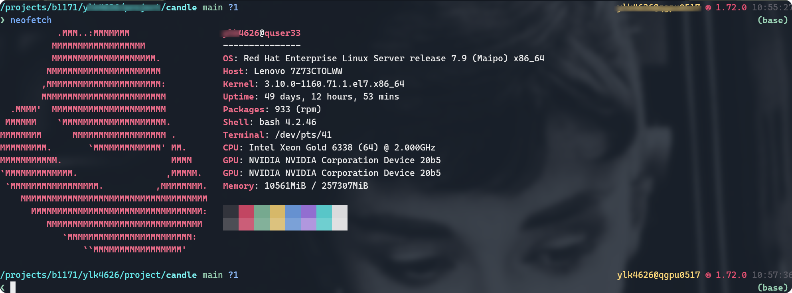
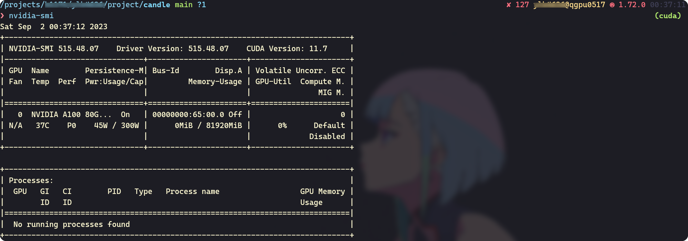
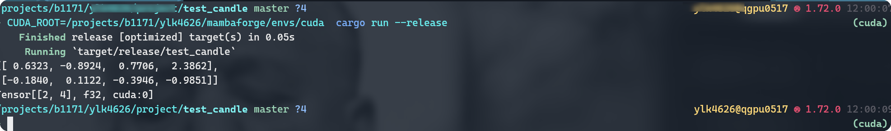
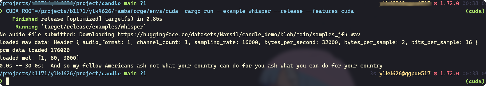
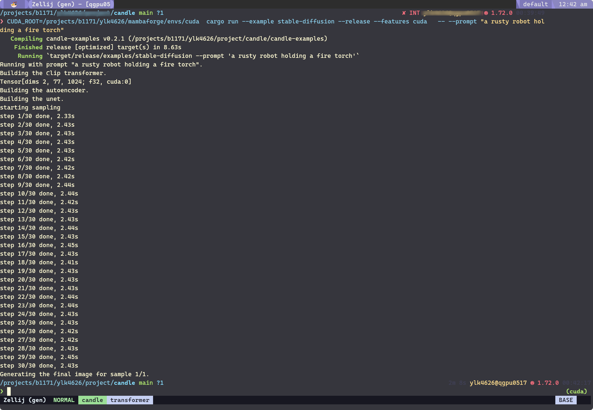

## 1. Deep learning inference

Python still dominates model training, but both Rust and C++ are becoming serious options for inference, where Python's overhead starts to hurt.
Large language models (LLMs) such as ChatGPT have multiplied since their debut, and companies and research groups keep releasing new ones, though not all of them are equally useful.

Large image generation models such as Stable Diffusion and Midjourney draw similar attention.
LLMs and image generators share one trait: they have billions of parameters and occupy gigabytes of memory.

Privacy is a major concern for LLM users.
Most of us would rather not have our data harvested by these systems for free.
Open-source models such as LLaMA aim to compete with ChatGPT while keeping user data local.
The most private option is to run the model on your own device, but consumer hardware rarely has a powerful enough CPU or GPU.
That is why the community has pushed hard on inference speed.
[llama.cpp], written in C/C++, addresses this with SIMD, quantization, mixed precision, and acceleration on several backends (GPU, MKL, and others).
Community contributions have made many popular models runnable through [llama.cpp], which puts LLMs within reach of ordinary devices.

While C++ and [llama.cpp] offer substantial benefits, Rust has its own niche, particularly WebAssembly and web or GUI applications[^1].
Several young but fast-moving deep learning frameworks, such as [dfdx], [burn], and [candle], are written purely in Rust and support multiple accelerated backends across platforms.

In short, once training is done, deployment can be handled by either llama.cpp or a Rust-based solution, which makes large models accessible on a wide range of devices.
My own setup is a MacBook Pro with an M1 chip plus a remote High-Performance Computing (HPC) cluster for CUDA.
The figure below shows the HPC setup.



## 2. Check your CUDA driver version

I kept running into problems configuring CUDA on the HPC cluster.
This post records how I worked around them without administrative rights.

To get a working CUDA environment for Rust and C++, you need to confirm that the CUDA libraries and headers are installed, point the build system at them, and sometimes set compiler flags and paths by hand.

Start by checking the driver:

```bash
nvidia-smi
```



On the remote HPC cluster, the CUDA driver is version 11.7.
Without administrative access, we cannot update the driver, so we have to install a matching CUDA 11.7 toolkit.

## 3. Use conda to install CUDA and gcc/g++

I recommend [mamba] over [conda] because it resolves and installs dependencies much faster.
In the example below, [mamba] is installed at `/home/mambaforge`.


Replace `/home/mambaforge` with your own installation path when you follow along.


### Create a new environment

Create a fresh environment to avoid dependency conflicts.
Python 3.10 is the current stable release.

```bash
mamba create -n cuda python=3.10
mamba activate cuda
```

### Install CUDA

Install the CUDA package from the `nvidia` channel, pinning the version with a label.
Here we install CUDA 11.7.

```bash
mamba install cuda -c nvidia/label/cuda-11.7.0
```

### Install a compiler

You also need a compatible compiler.
Otherwise the build will fall back to the system default, such as `/usr/bin/gcc`.

```bash
mamba install gcc=11.0 gxx=11.0 cmake
```

Set the environment variable `CUDA_ROOT` so that the build can find CUDA.

```bash
CUDA_ROOT=/home/mambaforge/envs/cuda RUSTFLAGS="-L/home/mambaforge/envs/cuda/lib/stubs" cargo run
CUDA_ROOT=/home/mambaforge/envs/cuda g++ -o test test.cpp
```

To avoid setting `CUDA_ROOT` every time, store it as an environment-specific variable.

```bash
mamba env config vars set CUDA_ROOT=/home/mambaforge/envs/cuda
mamba env config vars set RUSTFLAGS="-L/home/mambaforge/envs/cuda/lib/stubs"
```

Reactivate the environment so the variables take effect.

```bash
mamba activate cuda
```

## 4. Quick start for candle

[candle] is a deep learning framework written in Rust, a language that is particularly strong for WebAssembly.
Mature full-stack WebAssembly libraries such as [leptos] and [dixous] reinforce that strength.
If you want to build a web application backed by deep learning, Rust is a strong choice.
Let's try [candle] with CUDA.

```bash
cargo new test_candle
cd test_candle
```

Add `candle` as a dependency with the CUDA feature enabled.

```bash
cargo add candle_core --features cuda
```

Edit `src/main.rs` and run a first test on the CPU.

```rust
use candle_core::{Device, Tensor};

fn main() -> Result<(), Box<dyn std::error::Error>> {
    let device = Device::Cpu;

    let a = Tensor::randn(0f32, 1., (2, 3), &device)?;
    let b = Tensor::randn(0f32, 1., (3, 4), &device)?;

    let c = a.matmul(&b)?;
    println!("{c}");
    Ok(())
}
```

```bash
cargo run
```

Now switch to the GPU.

```rust
use candle_core::{Device, Tensor};

fn main() -> Result<(), Box<dyn std::error::Error>> {
    let device = Device::new_cuda(0)?;
    let a = Tensor::randn(0f32, 1., (2, 3), &device)?;
    let b = Tensor::randn(0f32, 1., (3, 4), &device)?;

    let c = a.matmul(&b)?;
    println!("{c}");
    Ok(())
}
```

```console
$ cargo run
[[ 0.6323, -0.8924,  0.7706,  2.3862],
 [-0.1840,  0.1122, -0.3946, -0.9851]]
Tensor[[2, 4], f32, cuda:0]
```



### Try more candle examples

```bash
git clone https://github.com/huggingface/candle.git
cd candle
```

### Whisper

Assuming `CUDA_ROOT` and `RUSTFLAGS` are already set in the environment:

```bash
cargo run --example whisper --features cuda --release
```

Alternatively, set them just for this command.

```bash
CUDA_ROOT="/home/mambaforge/envs/cuda" RUSTFLAGS="-L/home/mambaforge/envs/cuda/lib/stubs" cargo run --example whisper --features cuda --release
```



### Stable Diffusion

```bash
cargo run --example stable-diffusion --release --features cuda -- --prompt "a rusty robot holding a fire torch"
```



The generated image:


## 5. Bonus

This bash script requests an interactive compute node through `slurm`.
Change `-p b1171 --account=b1171` to your own partition and account before using it.

```bash
#!/bin/bash
set -e
set -u
set -o pipefail

# Set default values
use_gpu=0
gpu_number=1

# Display help message
display_help() {
        local script_name=$(basename "$0")
        echo "Usage: $script_name <time> <memory> [gpu_number]"
        echo
        echo "   time         The time parameter value in hours"
        echo "   memory       The memory parameter value in GB"
        echo "   gpu_number   The number of GPUs (default: 1)"
        exit 1
}

# Check if both parameters are provided
if [ "$#" -lt 2 ]; then
        display_help
fi

time="$1"
memory="$2"

# If third parameter exists, assign its value to gpu_number and set the use_gpu flag
if [ "$#" -ge 3 ]; then
    gpu_number="$3"
    use_gpu=1
fi

echo "Time: $time hours"
echo "Memory: $memory GB"

if [ "$use_gpu" -eq 1 ]; then
    echo "Using GPU with GPU Number: $gpu_number"
    srun -n 8 -p b1171 --account=b1171 -t ${time}:00:00 --gres=gpu:a100:$gpu_number --mem ${memory}g --pty bash
else
    echo "Using CPU only"
    srun -n 8 -p b1171 --account=b1171 -t ${time}:00:00 --mem ${memory}g --pty bash
fi
```

## 6. Caveat

You may hit this linker error:

```text
undefined reference to `memcpy@GLIBC_2.14'
```

Check the `glibc` installed in the conda environment:

```console
$ mamba list | rg sys
sysroot_linux-64          2.12                he073ed8_16    conda-forge
```

It turns out that `conda` ships `GLIBC_2.14` regardless of the compiler version.
The workaround is to use `module` instead.

Check the available CUDA versions:

```bash
module spider cuda
```

Load a CUDA module that matches your compiler:

```bash
module load cuda/gcc-11.3.0
```

## 7. Q & A



`module load` is great, but we cannot control everything. Installing CUDA into a conda environment keeps the toolchain reproducible and independent of what the cluster admins ship.





[^1]: https://github.com/flosse/rust-web-framework-comparison

<!-- links -->

[llama.cpp]: https://github.com/ggerganov/llama.cpp
[candle]: https://github.com/huggingface/candle
[burn]: https://github.com/burn-rs/burn
[dfdx]: https://github.com/coreylowman/dfdx
[mamba]: https://mamba.readthedocs.io/en/latest/index.html
[conda]: https://docs.conda.io/en/latest/
[leptos]: https://github.com/leptos-rs/leptos
[dixous]: https://dioxuslabs.com/
